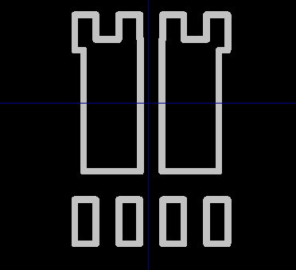
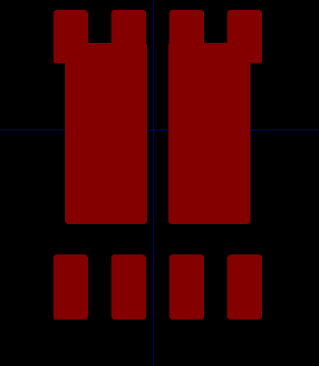

# `dxf_to_kicad_mod`
Script that helps with generating kicad footprint from dxf file created from a CAD sketch

Create `Kicad` footprint from `DXF` CAD sketch file. It is difficult to create intricate `Kicad` footprint. Currently, I am using `Kicad` to design PCBs, however this means that I spend plenty of time on footprint design. Creating a shape in CAD tools is simple and accurate but once and converted to the `Kicad` footprint format the DXF import is not filled. Thus this requires some workaround.

A generated footprint was from [a dxf file](example.dxf). When first imported into kicad footprint feature it looked like the follwoing

 

After running the script the following footprint was generated:



The corresponding [`kicad_mod` file](out_example.kicad_mod) which could be viewed
by `Kicad` footprint viewer.

## How it works

Create a DXF file of your sketch. Import the DXF file into the `Kidcad` footprint editor. An outline of your shape will be generated. Save this footprint to a library. The script takes this `Kidcad` footprint and converts lines to a polygon using `fp_poly` command in `kicad_mod` file. The script also plots what the shape would look like, thus you know if the script works appropriately. Must exit the plot in order to generate the new `Kidcad` footprint.

## Limitations

* it only support lines. In the future, I may add more shape support (by converting the shapes to lines, including arcs)
* each line must connect with another line beginning or end point very precisely, as the algorithm searches the points location only. It is okay if shapes overlap as long as start or end coordinates of the lines is unique.
* pads are not created, thus you'd need to go into the foorprint and place them yourself.

## how to use
### install python
### install pandas
### install matplotlib

```
https://github.com/onissan/dxf_to_kicad_mod.git
```

### clone this `repe`

```
clone https://github.com/onissan/dxf_to_kicad_mod.git
cd dxf_to_kicad_mod
```

### using following command line to generate `kicad_mod`

```
python dxf_to_kicad_mod "Your-kicad-mod-file-name-here" 
```
